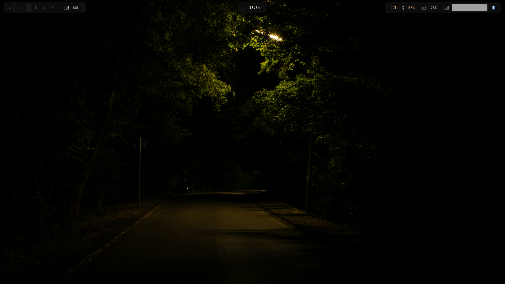
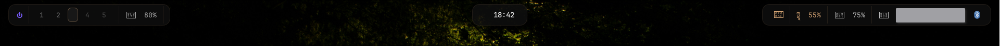
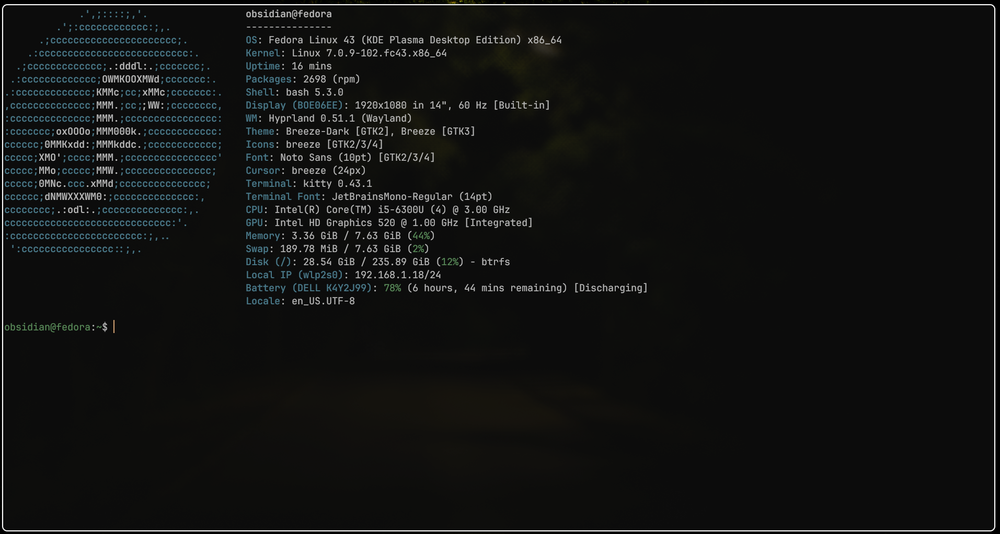
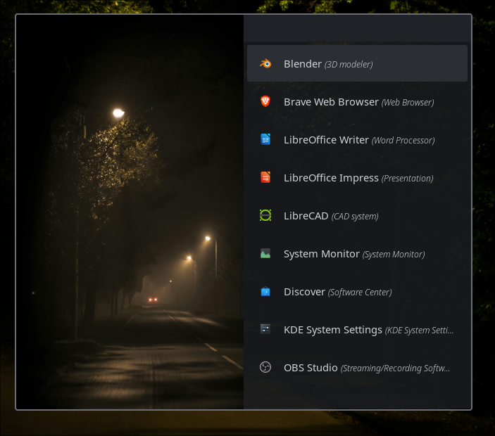
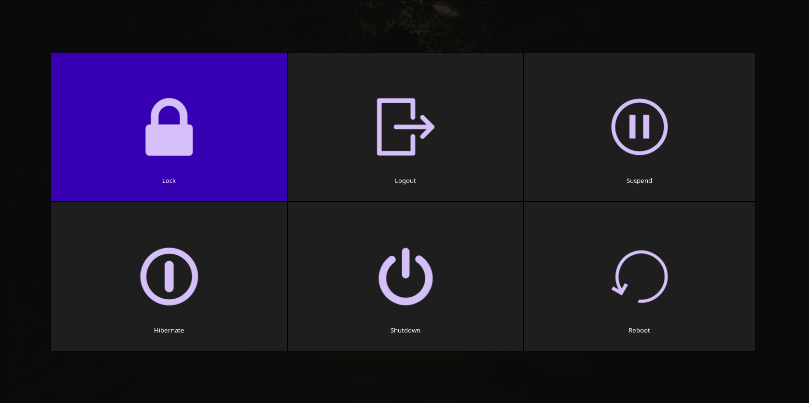
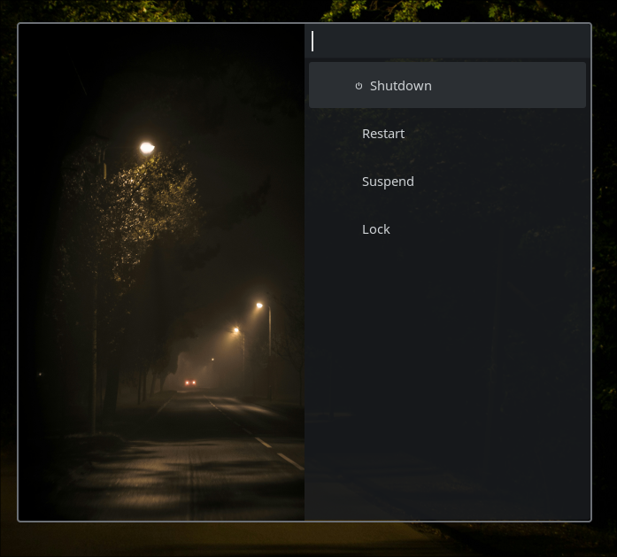

<div align="center">

```
  ██████╗ ██████╗ ███████╗██╗██████╗ ██╗ █████╗ ███╗   ██╗
 ██╔═══██╗██╔══██╗██╔════╝██║██╔══██╗██║██╔══██╗████╗  ██║
 ██║   ██║██████╔╝███████╗██║██║  ██║██║███████║██╔██╗ ██║
 ██║   ██║██╔══██╗╚════██║██║██║  ██║██║██╔══██║██║╚██╗██║
 ╚██████╔╝██████╔╝███████║██║██████╔╝██║██║  ██║██║ ╚████║
  ╚═════╝ ╚═════╝ ╚══════╝╚═╝╚═════╝ ╚═╝╚═╝  ╚═╝╚═╝  ╚═══╝
```

**obsidian** · Hyprland dotfiles  
*Fedora · Hyprland · Waybar · Kitty · Neovim*


</div>

---

## 🖼️ Preview









---

## 🎨 Color Palette · Obsidian Amber

A dark obsidian glass base with desert amber as the primary accent and soft violet for secondary highlights.

| Role | Hex |
|------|-----|
| Background (glass) | `#0f0f0f` |
| Surface | `#1a1a1a` |
| Inactive | `#5e5e5e` |
| Empty / dark | `#404040` |
| Text (secondary) | `#a0a0a0` |
| Text (icons/muted) | `#b9b9b9` |
| Text (primary) | `#e5e5e5` |
| **Amber accent** | `#d4a373` |
| **Violet accent** | `#7a5cff` |

---

## 🗂️ Structure

```
obsidian/
├── .config/
│   ├── hypr/           # Hyprland — monitor, keybinds, animations, window rules
│   ├── waybar/         # Bar — config + style.css (three amber pills)
│   ├── kitty/          # Terminal — Obsidian Amber theme, JetBrains Mono
│   └── nvim/           # Neovim — lazy.nvim, LSP, DAP, Treesitter
├── assets/             # Wallpapers, screenshots
└── README.md
```

---

## ⚙️ Stack

| Layer | Tool |
|-------|------|
| Window Manager | [Hyprland](https://hyprland.org) · dwindle layout |
| Bar | [Waybar](https://github.com/Alexays/Waybar) · three floating pills |
| Terminal | [Kitty](https://sw.kovidgoyal.net/kitty/) · `background_opacity 0.82` |
| Editor | [Neovim](https://neovim.io) · lazy.nvim |
| Launcher | [rofi](https://github.com/davatorium/rofi) · drun mode |
| Wallpaper | [swww](https://github.com/LGFae/swww) |
| Screenshots | [grim](https://github.com/emersion/grim) + [slurp](https://github.com/emersion/slurp) |
| Power menu | [wlogout](https://github.com/ArtsyMacaw/wlogout) |
| Font | JetBrains Mono Nerd Font · 14px |

---

## 🪟 Hyprland

- **Layout:** dwindle, `gaps_in = 5`, `gaps_out = 10`, `border_size = 2`, `rounding = 8`
- **Wallpaper:** set at login via `swww-daemon` + `swww img`
- **Autostart:** Waybar, nm-applet, blueman-applet, polkit agent
- **Vim-style focus movement:** `SUPER + h/j/k/l`
- **Resize submap:** `SUPER + R` → arrow keys or `h/j/k/l` → `Escape` to exit
- **Minimize toggle:** `SUPER + M` / `SUPER + SHIFT + M` via special workspace

### Keybinds (highlights)

| Keys | Action |
|------|--------|
| `SUPER + RETURN` | Kitty |
| `SUPER + D` | rofi launcher |
| `SUPER + Q` | Kill active window |
| `SUPER + F` | Fullscreen |
| `SUPER + V` | Toggle floating |
| `SUPER + B` | Firefox |
| `SUPER + O` | OBS |
| `SUPER + N` | Blender |
| `SUPER + M` | Toggle minimize |
| `SUPER + SHIFT + E` | wlogout power menu |
| `SUPER + R` | Enter resize submap |
| `PRINT` | Area screenshot → `~/Pictures/Screenshots/` |
| `XF86Brightness*` | brightnessctl ±10% |
| `XF86Audio*` | pactl volume ±5% / mute |

---

## 🍫 Waybar

Three floating pill modules — left, center, right — with a consistent amber border and hover glow.

- **Font:** JetBrains Mono 13px
- **Background:** `rgba(15, 15, 15, 0.82)` glass, `1px` amber border at 10% opacity
- **Separators:** subtle amber dividers between modules
- **Hover:** amber highlight `#d4a373` on interactive modules
- **Active workspace:** amber fill with brighter border
- **Critical battery:** violet `#7a5cff` with blink animation
- **Power button:** violet, top-left of left pill

---

## 🐱 Kitty

- **Theme:** Obsidian Amber — matches Waybar exactly
- **Opacity:** `0.82` (glass effect)
- **Font:** JetBrains Mono 14px
- **Cursor:** beam, amber `#d4a373`, always blinking, cursor trail enabled
- **Selection:** amber highlight
- **URLs:** violet `#7a5cff`
- **16-color palette:** ambers replace yellows, violet replaces magenta, muted teals for blues

---

## 📝 Neovim

Modular Lua config powered by `lazy.nvim` — lives in `.config/nvim/`.

**Plugins:**
- `nvim-lspconfig` + Mason (clangd, pyright)
- `nvim-treesitter` (C, C++, Python, Lua)
- `nvim-dap` + `nvim-dap-ui` (codelldb for C/C++, debugpy for Python)
- `telescope.nvim`, `nvim-cmp`, `lualine.nvim`

> Also maintained separately at [`alihassan200721/ashborn-nvim`](https://github.com/alihassan200721/ashborn-nvim)

---

## 📦 Dependencies

```bash
# Core
sudo dnf install hyprland waybar kitty rofi swww wlogout

# Screenshot
sudo dnf install grim slurp

# System tray / applets
sudo dnf install network-manager-applet blueman

# Utilities
sudo dnf install brightnessctl

# Fonts
sudo dnf install jetbrains-mono-fonts

# Neovim
sudo dnf install neovim
```

---

## 🚀 Installation

> ⚠️ **Back up your existing configs first.**

```bash
git clone https://github.com/alihassan200721/obsidian-dotfiles.git
cd obsidian-dotfiles
chmod +x install.sh
./install.sh
```

The script will ask whether to symlink or copy, back up existing configs, install scripts to `~/.local/bin/`, and optionally set the wallpaper.

**Manual install:**
```bash
cp -r .config/hypr ~/.config/
cp -r .config/waybar ~/.config/
cp -r .config/kitty ~/.config/
cp -r .config/nvim ~/.config/
```

---

## 🤝 Related

- [`alihassan200721/ashborn-fedora_hyprland`](https://github.com/alihassan200721/ashborn-fedora_hyprland) — other hyprland setup

---

<div align="center">
<sub>made with 🍂 by <a href="https://github.com/alihassan200721">alihassan200721</a></sub>
</div>
