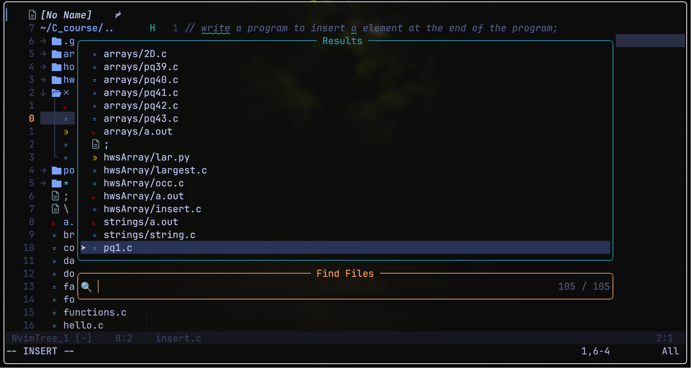

<div align="center">

```
  ██████╗ ██████╗ ███████╗██╗██████╗ ██╗ █████╗ ███╗   ██╗
 ██╔═══██╗██╔══██╗██╔════╝██║██╔══██╗██║██╔══██╗████╗  ██║
 ██║   ██║██████╔╝███████╗██║██║  ██║██║███████║██╔██╗ ██║
 ██║   ██║██╔══██╗╚════██║██║██║  ██║██║██╔══██║██║╚██╗██║
 ╚██████╔╝██████╔╝███████║██║██████╔╝██║██║  ██║██║ ╚████║
  ╚═════╝ ╚═════╝ ╚══════╝╚═╝╚═════╝ ╚═╝╚═╝  ╚═╝╚═╝  ╚═══╝
```

**obsidian** · Hyprland dotfiles  
*Fedora · Hyprland · Waybar · Kitty · Neovim · tmux*


</div>

---

## 🖼️ Preview





---

## 🎨 Color Palette · Obsidian Amber

A dark obsidian glass base with desert amber as the primary accent and soft violet for secondary highlights.

| Role | Hex |
|------|-----|---------|
| Background (glass) | `#0f0f0f` | 
| Surface | `#1a1a1a` | 
| Inactive | `#5e5e5e` | 
| Empty / dark | `#404040` | 
| Text (secondary) | `#a0a0a0` | 
| Text (icons/muted) | `#b9b9b9` |
| Text (primary) | `#e5e5e5` | 
| **Amber accent** | `#d4a373` | 
| **Violet accent** | `#7a5cff` | 

---

## 🗂️ Structure

```
obsidian-dotfiles/
├── assets/                 # Screenshots & wallpaper
├── fastfetch/              # Fastfetch config
├── hypr/
│   └── hyprland.conf       # Monitor, keybinds, animations, window rules
├── kitty/
│   └── kitty.conf          # Obsidian Amber theme, JetBrains Mono
├── nvim/                   # ⚠️  Legacy config (has known bugs — see note below)
│   ├── init.lua
│   └── lua/plugins/
├── nvim-new-setup/         # ✅  Active config — use this one
│   └── nvim/
│       ├── init.lua
│       └── lua/ali/
│           ├── core/       # options.lua, keymaps.lua
│           ├── lazy.lua
│           └── plugins/    # all plugin specs
├── rofi/                   # Launcher theme
├── tmux/
│   └── tmux.conf
├── waybar/
│   ├── config              # Module layout
│   ├── style.css           # Three amber pills
│   ├── brightness.sh
│   └── scripts/            # music.sh, waybar-autohide.sh, waybar-toggle.sh
├── wlogout/
│   ├── layout
│   ├── style.css
│   └── icons/
└── README.md
```

> **⚠️ Neovim — Two configs, use the new one**
>
> The `nvim/` folder is the **old config** — it has some Lua errors that show up on startup (annoying but harmless). It's kept around in case something needs to be pulled from it.
>
> **Use `nvim-new-setup/nvim/` instead.** It's a full rewrite under `lua/ali/`, uses `lazy.nvim`, has zero startup errors, and is significantly cleaner. Copy it to `~/.config/nvim/` during installation.

---

## ⚙️ Stack

| Layer | Tool |
|-------|------|
| Window Manager | [Hyprland](https://hyprland.org) · dwindle layout |
| Bar | [Waybar](https://github.com/Alexays/Waybar) · three floating pills |
| Terminal | [Kitty](https://sw.kovidgoyal.net/kitty/) · `background_opacity 0.82` |
| Multiplexer | [tmux](https://github.com/tmux/tmux) · vim-style panes, `Ctrl+a` prefix |
| Editor | [Neovim](https://neovim.io) · lazy.nvim (new setup) |
| Launcher | [rofi](https://github.com/davatorium/rofi) · drun mode |
| Wallpaper | [swww](https://github.com/LGFae/swww) |
| Screenshots | [grim](https://github.com/emersion/grim) + [slurp](https://github.com/emersion/slurp) |
| Power menu | [wlogout](https://github.com/ArtsyMacaw/wlogout) · custom Obsidian Amber theme |
| Font | JetBrains Mono Nerd Font · 14px |

---

## 🪟 Hyprland

- **Layout:** dwindle, `gaps_in = 5`, `gaps_out = 10`, `border_size = 2`, `rounding = 8`
- **Wallpaper:** set at login via `swww-daemon` + `swww img`
- **Autostart:** Waybar (with autohide), nm-applet, blueman-applet, polkit agent, xwaylandvideobridge killed after 3s
- **Vim-style focus:** `SUPER + h/j/k/l`
- **Window move:** `SUPER + CTRL + h/j/k/l`
- **Resize submap:** `SUPER + R` → arrow keys or `h/j/k/l` → `Escape` to exit
- **Quick resize:** `SUPER + SHIFT + h/j/k/l` (works on tiled & floating)
- **Minimize toggle:** `SUPER + M` / `SUPER + SHIFT + M` via special workspace
- **Waybar toggle:** `SUPER + W`

### Keybinds

| Keys | Action |
|------|--------|
| `SUPER + RETURN` | Kitty terminal |
| `SUPER + D` | rofi launcher |
| `SUPER + Q` | Kill active window |
| `SUPER + E` | Dolphin file manager |
| `SUPER + F` | Fullscreen |
| `SUPER + V` | Toggle floating |
| `SUPER + B` | Firefox |
| `SUPER + O` | OBS |
| `SUPER + N` | Blender |
| `SUPER + W` | Toggle Waybar |
| `SUPER + M` | Toggle minimize |
| `SUPER + SHIFT + M` | Send to minimized workspace |
| `SUPER + SHIFT + E` | wlogout power menu |
| `SUPER + R` | Enter resize submap |
| `SUPER + h/j/k/l` | Move focus (vim-style) |
| `SUPER + ←/→/↑/↓` | Move focus (arrow keys) |
| `SUPER + CTRL + h/j/k/l` | Move tiled window |
| `SUPER + SHIFT + h/j/k/l` | Resize window |
| `SUPER + 1–5` | Switch workspace |
| `SUPER + SHIFT + 1–5` | Move window to workspace |
| `PRINT` | Area screenshot → `~/Pictures/Screenshots/` |
| `XF86MonBrightness*` | brightnessctl ±10% |
| `XF86Audio*` | pactl volume ±5% / mute |
| `Mouse1 + SUPER` | Move window |
| `Mouse2 + SUPER` | Resize window |

---

## 🍫 Waybar

Three floating pill modules — left, center, right — with amber borders and hover glow. Supports auto-hide via `waybar-autohide.sh` and manual toggle with `SUPER + W`.

**Module layout:**

| Pill | Modules |
|------|---------|
| Left | ⏻ Power · Workspaces · CPU · Memory · Audio |
| Center | Music · Clock |
| Right | Brightness · Battery · Bluetooth · Network · Tray |

- **Font:** JetBrains Mono 13px
- **Background:** `rgba(15, 15, 15, 0.82)` glass, `1px` amber border
- **Hover:** amber highlight `#d4a373` on interactive modules
- **Active workspace:** amber fill with brighter border
- **Critical battery:** violet `#7a5cff` with blink animation
- **Power button:** opens rofi shutdown/restart/suspend/lock menu
- **Brightness:** scroll to adjust ±5%, reads from `brightness.sh`
- **Music:** custom `music.sh` script in `waybar/scripts/`

---

## 🚪 wlogout

Custom Obsidian Amber themed power menu triggered by `SUPER + SHIFT + E`.

Options: Shutdown · Reboot · Suspend · Lock · Logout · Hibernate — each with a custom icon from `wlogout/icons/`.

Config lives in `wlogout/layout` and `wlogout/style.css`.

---

## 🐱 Kitty

- **Theme:** Obsidian Amber — matches Waybar exactly
- **Opacity:** `0.82` (glass effect)
- **Font:** JetBrains Mono 14px
- **Cursor:** beam, amber `#d4a373`, always blinking, cursor trail enabled
- **Selection:** amber highlight
- **URLs:** violet `#7a5cff`
- **16-color palette:** ambers replace yellows, violet replaces magenta, muted teals for blues

---

## 📺 tmux

Prefix changed from `Ctrl+b` to `Ctrl+a`. Vim-style pane navigation throughout.

### Keybinds

| Keys | Action |
|------|--------|
| `Ctrl+a` | Prefix (replaces `Ctrl+b`) |
| `Prefix + v` | Split pane vertically (opens at current path) |
| `Prefix + s` | Split pane horizontally (opens at current path) |
| `Prefix + h/j/k/l` | Move between panes (vim-style) |
| Mouse | Click to focus pane · drag to resize · scroll history |

---

## 📝 Neovim (new setup)

> Use `nvim-new-setup/nvim/` — copy it to `~/.config/nvim/`

Modular Lua config under `lua/ali/` powered by `lazy.nvim`. Zero startup errors, clean plugin separation.

**Plugins included:**

| Category | Plugin |
|----------|--------|
| LSP | `nvim-lspconfig` + `mason.nvim` + `mason-lspconfig` |
| Completion | `nvim-cmp` + snippet support |
| Syntax | `nvim-treesitter` |
| Fuzzy finder | `telescope.nvim` |
| File tree | `nvim-tree.lua` |
| Statusline | `lualine.nvim` |
| Bufferline | `bufferline.nvim` |
| Sessions | `auto-session` |
| Formatting | `conform.nvim` |
| UI | `alpha.nvim` · `dressing.nvim` · `indent-blankline.nvim` |
| Pairs | `nvim-autopairs` |
| Maximizer | `vim-maximizer` |
| Which key | `which-key.nvim` |
| Colorscheme | custom `obsidian_amber` |

### Keybinds

**Splits**

| Keys | Action |
|------|--------|
| `<leader> + sv` | Split window vertically |
| `<leader> + sh` | Split window horizontally |
| `<leader> + se` | Make splits equal size |
| `<leader> + sx` | Close current split |
| `Ctrl + h/j/k/l` | Move between split windows |

**Tabs**

| Keys | Action |
|------|--------|
| `<leader> + to` | Open new tab |
| `<leader> + tx` | Close current tab |
| `<leader> + tn` | Go to next tab |
| `<leader> + tp` | Go to previous tab |
| `<leader> + tf` | Open current buffer in new tab |

**General**

| Keys | Action |
|------|--------|
| `jk` | Exit insert mode |
| `<leader> + nh` | Clear search highlight |

**Telescope**

| Keys | Action |
|------|--------|
| `<leader> + ff` | Find files |
| `<leader> + fg` | Live grep |

**Sessions**

| Keys | Action |
|------|--------|
| `<leader> + ws` | Save session for cwd |
| `<leader> + wr` | Restore session for cwd |

---

## 📦 Dependencies

```bash
# Core
sudo dnf install hyprland waybar kitty rofi swww wlogout tmux

# Screenshot
sudo dnf install grim slurp

# System tray / applets
sudo dnf install network-manager-applet blueman

# Utilities
sudo dnf install brightnessctl

# Fonts
sudo dnf install jetbrains-mono-fonts

# Neovim
sudo dnf install neovim
```

---

## 🚀 Installation

> ⚠️ **Back up your existing configs first.**

```bash
git clone https://github.com/alihassan200721/obsidian-dotfiles.git
cd obsidian-dotfiles
chmod +x install.sh
./install.sh
```

The script will ask whether to symlink or copy, back up existing configs, install scripts to `~/.local/bin/`, and optionally set the wallpaper.

**Manual install:**
```bash
cp -r hypr       ~/.config/hypr
cp -r waybar     ~/.config/waybar
cp -r kitty      ~/.config/kitty
cp -r rofi       ~/.config/rofi
cp -r wlogout    ~/.config/wlogout
cp -r tmux/tmux.conf ~/.config/tmux/tmux.conf
cp -r fastfetch  ~/.config/fastfetch

# Neovim — use the new setup only
cp -r nvim-new-setup/nvim ~/.config/nvim
```

> **Note on Neovim:** Do **not** copy the top-level `nvim/` folder — that's the old config with known bugs. Always use `nvim-new-setup/nvim/`.

---

## 🤝 Related

- [`alihassan200721/ashborn-fedora_hyprland`](https://github.com/alihassan200721/ashborn-fedora_hyprland) — other Hyprland setup

---

<div align="center">
<sub>made with 🍂 by <a href="https://github.com/alihassan200721">alihassan200721</a></sub>
</div>
